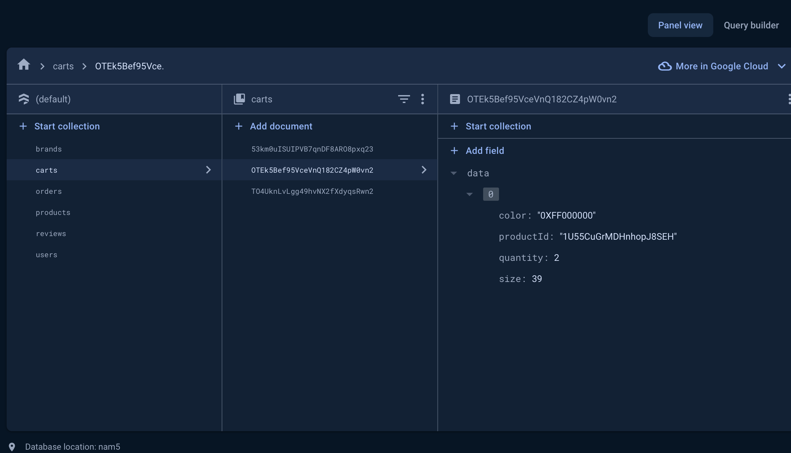
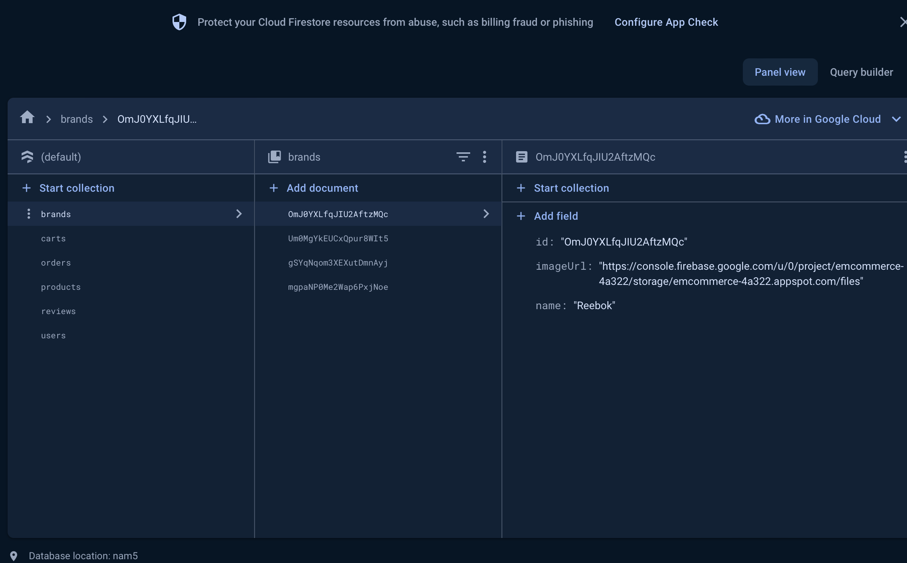
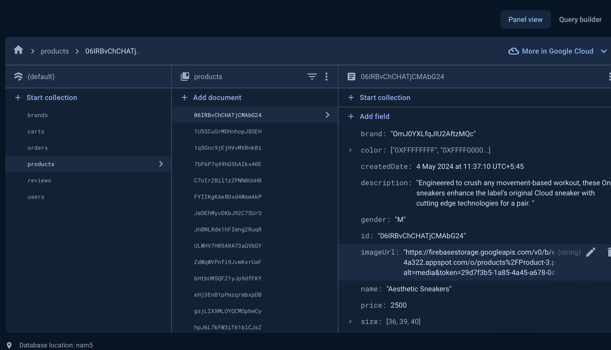
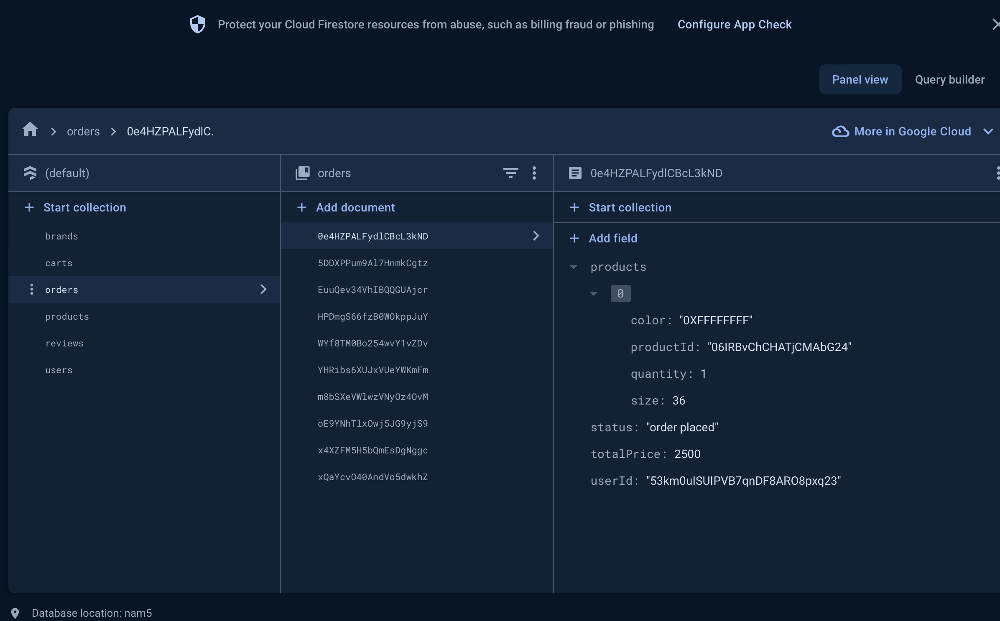
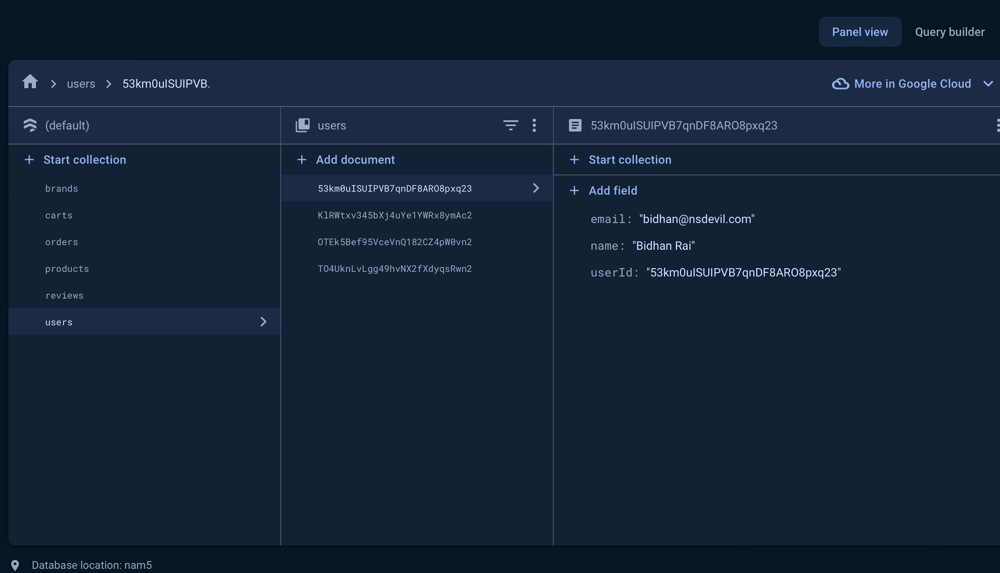

# ecommerce

## Description

This is a Flutter project done as a test project for [Priority Soft](https://www.prioritysoft.rs)

## Project Overview

There are 18 products in total. Some products may have similar images but they are unique products.
There are in total 6 collections. reviews, carts, users, products, orders, brands.

## Project setup

- git clone https://github.com/Bidhanrai/ecommerce.git
- cd project-directory
- flutter pub get
- flutter run
- NOTE: I have also emailed you the apk at info@prioritysoft.rs where I have implemented google sign in and guest login. You can login via both. 
But if you run the code from your device google sign in will throw error as it needs the device SHA1 key to be registered in firebase. You can use guest login.

## Challenges you faced and how you overcame them

- I initially had a few misconceptions about Firebase Functions, likely because I hadn't used them before. 
However, after implementing them in the project, I found the experience quite challenging and enjoyable.
I overcame the challenge by googling, reading documentations and little bit of chat gpt.

- I have structured my collections in a normalized format to avoid data redundancy, with product reviews residing in a 
separate collection. Consequently, querying products based on the highest reviews directly is not feasible. To address this, 
the solution would be denormalize the data for this use case by adding or updating a new object field inside the product documents whenever 
a user reviews a product. This object will contain the average review and the total review count. Thus, each time a user submits a 
review, the database will be updated in two places: within the product documents and in the review collection.

## Additional done

- Authentication for identifying who placed the order (Google sign in with Firebase)

## Can be done for better User Experience

- Code generators can be used for repetitive tasks like handing json responses, models etc (Dev POV)
- Support float/double value for ratings (1.5, 2.5, 3.5...)
- Add product quantity field as user can change quantity of product while making purchase
- Use shimmer loaders

## Database screenshots

